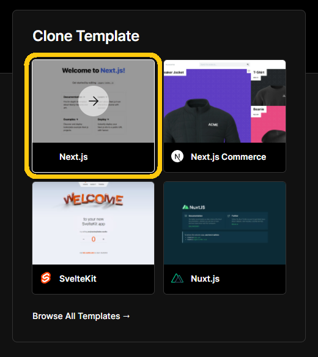
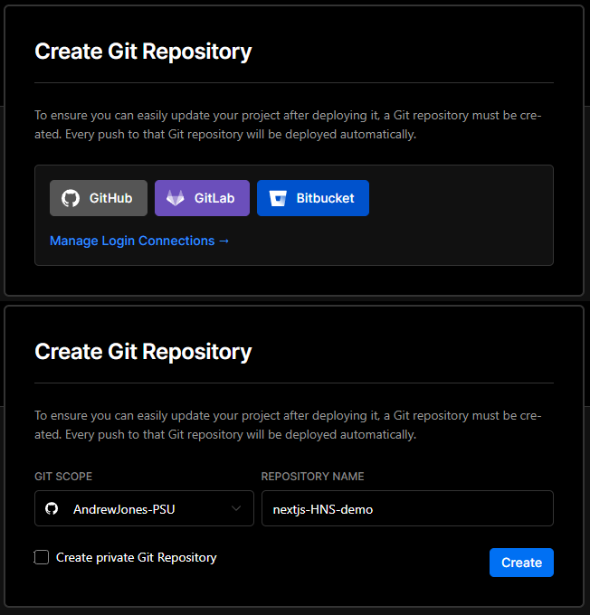

# Blockchain@PSU Handshake Demo Workshop
This repository contains a simple website created using NextJS. This README is meant as a guide on how to create this simple website as well as hosting it on Vercel and connecting it to a Handshake domain.

This project was made for Blockchain@PSU's 2nd Handshake workshop.

---
## 1 - Initializing NextJS + Creating the Project

Before we can start, we need to install NextJS and create the project using Vercel. If you've already installed NextJS, skip to section 1.2, which is where we create the project.

### 1.1 - Installing NextJS & Other Dependencies

First, make sure you have [git](https://git-scm.com/downloads) installed to your computer and you have a [GitHub](https://github.com) account. You'll need to use GitHub in order to connect your project with Vercel. You can also use GitLab or BitBucket, but for this demonstration we'll use GitHub.

In addition, I recommend you install Visual Studio Code. You can use whatever IDE you would like, but for this demonstration we'll use VSCode.

Next, we'll install NextJS to our system. To do this, we'll first need to install [NodeJS](https://nodejs.org/en/). Click the link, download the LTS/Recommended version, and install it.

**Important:** During the installation process for NodeJS, you'll be asked what features you'd like to include, one of these being setting the PATH value in your system. Make sure this is included, as this will allow us to easily use Node Package Manager (NPM) from the command line (Typically this option is included by default, but double-check anyways).

You can test whether or not NodeJS and your PATH variable is setup correctly by typing `npm -v` in a command line. This should return the version of NPM. If this doesn't work, try reinstalling NodeJS.

Once NodeJS is installed, open a command prompt and type `npm install next`. This will install the packages needed to run NextJS.

### 1.2 - Creating the Project

Now that we have all of our dependencies sorted out, we can get to work and create the project!

Start by heading over to [vercel.com](https://vercel.com/). If you don't have an accout yet, click on "Try Vercel" at the top right of the page, and make an account. I recommend using your GitHub account to do so. After creating your account, you should be prompted to create a project. For this demo, we'll use a template, specifically the "Next.js" template:

After selecting this template, we'll be asked to create a Git repository. Click on "GitHub" and choose a repository name (I named mine nextJS-HNS-demo, but you can name yours whatever you'd like). You can then choose to make the repository public or private, but I recommend you make it public. Now, click on "Create" to create the project.

Now we're done! Head on over to GitHub and open the repository. Go ahead and clone this repository to your system. We can then edit this repository directly.

Note that every time we push to GitHub on the main branch, Vercel will automatically compile the website and deploy it, meaning we don't need to do any extra work outside of setting up our DNS.
